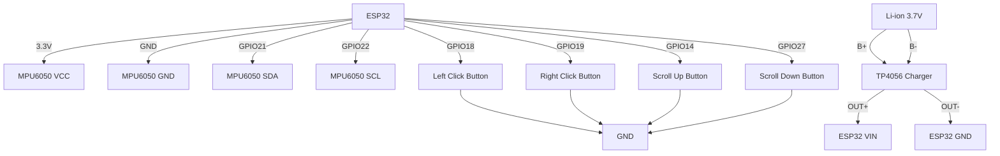
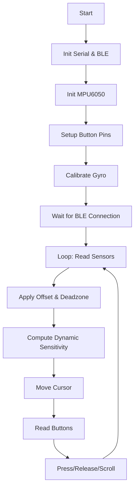

# 🖱️ ESP32 Air Mouse with MPU6050

A wireless air mouse based on **ESP32** and **MPU6050** (6‑axis gyroscope/accelerometer).  
It uses **BLE** to emulate a Bluetooth mouse, with physical buttons for left/right click and scroll.

---

## ✨ Features

- **Wireless BLE Mouse** – connect to any BLE‑enabled host (Windows, macOS, Linux, Android, iOS).
- **Motion‑controlled cursor** – tilt the device to move the pointer.
- **Auto‑calibration** – gyro offsets are measured at startup for stable drift‑free operation.
- **Dynamic sensitivity** – faster movements accelerate cursor speed for natural control.
- **Deadzone filtering** – eliminates jitter when holding the device still.
- **Four physical buttons** – left click, right click, scroll up, scroll down.
- **Low‑latency loop** – 5 ms delay for smooth responsiveness.

---

## 📦 Hardware Required

| Component          | Quantity | Notes |
|--------------------|----------|-------|
| ESP32 Dev Board    | 1        | Any with BLE, e.g., ESP32‑WROOM |
| MPU6050            | 1        | 6‑axis IMU (I²C) |
| Push buttons       | 4        | Tactile switches |
| 3.7 V Li‑ion battery| 1       | e.g., 300 mAh or larger |
| TP4056 charger module | 1    | With battery protection (optional but recommended) |
| Resistors          | 4× 10 kΩ | Pull‑up resistors (if not using INPUT_PULLUP) |
| Wires & breadboard |          | For prototyping |

---

## 🔌 Wiring Diagram (Mermaid)

Below is a schematic representation using Mermaid. It shows the connections between the ESP32, MPU6050, buttons, and power.



> **Important**: The MPU6050 **must** be powered from 3.3 V (not 5 V) unless your breakout board has its own regulator.

---

## 📄 Pin Assignment Table

| Function          | ESP32 Pin | Button to GND |
|-------------------|-----------|---------------|
| Left Click        | GPIO18    | Yes           |
| Right Click       | GPIO19    | Yes           |
| Scroll Up         | GPIO14    | Yes           |
| Scroll Down       | GPIO27    | Yes           |
| MPU6050 SDA       | GPIO21    | –             |
| MPU6050 SCL       | GPIO22    | –             |
| MPU6050 VCC       | 3.3V      | –             |
| MPU6050 GND       | GND       | –             |

All buttons are connected with internal pull‑up resistors (`INPUT_PULLUP`), so they read `LOW` when pressed.

---

## ⚙️ Software Setup

### 1. Install Required Libraries

Open the Arduino Library Manager and install:

- **BleMouse** (by T-vK) – for BLE HID emulation  
- **Adafruit MPU6050** – sensor driver  
- **Adafruit Sensor** – unified sensor abstraction  
- **Wire** – built‑in I²C library

### 2. Install ESP32 Board Support

1. In Arduino IDE, go to **File → Preferences**.
2. Add the following URL to **Additional Boards Manager URLs**:  
   `https://raw.githubusercontent.com/espressif/arduino-esp32/gh-pages/package_esp32_index.json`
3. Open **Tools → Board → Boards Manager**, search for `esp32` and install the **ESP32 by Espressif Systems** package.

### 3. Select the Correct Board

Choose your board under **Tools → Board** (e.g., `ESP32 Dev Module`).  
Set the **Partition Scheme** to `Huge APP` if you encounter storage issues.

### 4. Open the Sketch

- Download/clone this repository.
- Open `main.ino` (or `src/air_mouse.ino`).
- Connect the ESP32 via USB.
- Select the correct COM/Port in **Tools → Port**.
- Click **Upload**.

---

## 🧭 Calibration

When the device starts, it automatically runs a **gyro calibration**:

- Keep the device **completely still** for about 2 seconds.
- The serial monitor will display the calculated offsets.
- After calibration, the cursor should not drift when stationary.

> If you notice drift after some time, press the reset button on the ESP32 to re‑calibrate.

---

## 🖱️ Usage

1. **Power on** the device – the ESP32 will start broadcasting as `ESP32 BLE Mouse`.
2. On your host device, go to Bluetooth settings and pair with `ESP32 BLE Mouse`.
3. Once connected, the cursor will follow the **tilt** of the device:
   - **Pitch** (forward/backward) → vertical movement.
   - **Yaw** (left/right) → horizontal movement (inverted for natural feel).
4. **Click** the physical buttons:
   - Button on GPIO18 = left click
   - Button on GPIO19 = right click
   - GPIO14 = scroll up
   - GPIO27 = scroll down (with a small debounce delay).
5. The cursor speed adapts dynamically: faster tilting moves the cursor quicker.

---

## 📈 Software Flowchart



---

## 🛠️ Troubleshooting

| Issue                        | Possible Cause / Solution |
|------------------------------|---------------------------|
| MPU6050 not detected         | Check wiring; SDA/SCL may need pull‑up resistors. Ensure VCC is 3.3 V. |
| Cursor jumps or drifts       | Calibration failed – restart and keep device still during calibration. |
| No BLE device found          | Ensure `bleMouse.begin()` succeeds; try re‑flashing or resetting. |
| Buttons not responding       | Verify pin numbers; buttons are active‑low, ensure they connect to GND. |
| Battery doesn’t charge       | Confirm TP4056 wiring; use a multimeter to check voltage at VIN. |

---

## 🔋 Power & Battery Life

- A 300 mAh Li‑ion battery can power the ESP32 for ~2‑3 hours (depending on BLE activity).
- Use a **TP4056** charger module with over‑discharge protection.
- **Always** add a physical power switch to cut the battery when not in use.

---

## 📂 Folder Structure

```
.
├── main.ino                 # Main source code
├── README.md                # This file
├── hardware/
│   └── circuit_diagram.jpg  # Wiring image (local)
└── docs/
    ├── diagrams.pdf         # Detailed schematic
    └── poster.png           # Project poster
```

---

## 📚 References

- [MPU6050 Datasheet](https://invensense.tdk.com/wp-content/uploads/2015/02/MPU-6000-Datasheet1.pdf)
- [ESP32 BLE Mouse Library](https://github.com/T-vK/ESP32-BLE-Mouse)
- [Adafruit MPU6050 Library](https://github.com/adafruit/Adafruit_MPU6050)

---

## 📜 License

This project is open‑source and available under the **MIT License**. Feel free to modify and distribute.

---

**Happy pointing!** 🚀
```
